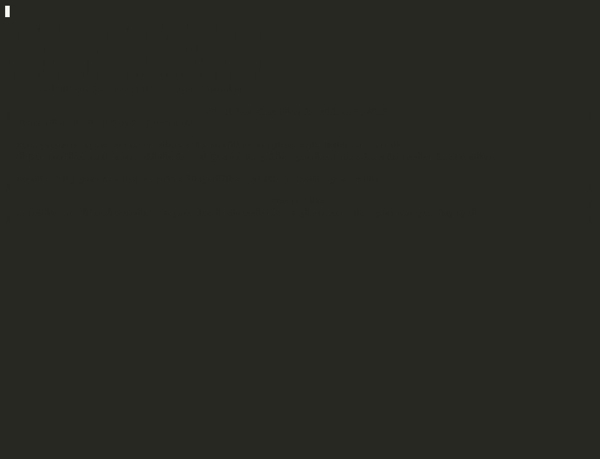

<div align="center">

```
 ██████╗ ██╗   ██╗███████╗ █████╗ ███╗   ██╗ ██████╗      ██████╗██╗     ██╗
██╔════╝ ██║   ██║██╔════╝██╔══██╗████╗  ██║██╔═══██╗    ██╔════╝██║     ██║
██║  ███╗██║   ██║███████╗███████║██╔██╗ ██║██║   ██║    ██║     ██║     ██║
██║   ██║██║   ██║╚════██║██╔══██║██║╚██╗██║██║   ██║    ██║     ██║     ██║
╚██████╔╝╚██████╔╝███████║██║  ██║██║ ╚████║╚██████╔╝    ╚██████╗███████╗██║
 ╚═════╝  ╚═════╝ ╚══════╝╚═╝  ╚═╝╚═╝  ╚═══╝ ╚═════╝     ╚═════╝╚══════╝╚═╝
```

**Learn how malware propagates — safely, interactively, and without touching your real filesystem**

[](https://www.python.org/)
[](LICENSE)
[](https://github.com/AaronGonzalez03/Worm-CLI)
[](#disclaimer)
[](CONTRIBUTING.md)

[Features](#-features) · [Installation](#-installation) · [Usage](#-usage) · [Commands](#-command-reference) · [Architecture](#-architecture) · [Disclaimer](#-disclaimer) · [Contributing](#-contributing)

</div>

---

## Overview

**Worm-CLI** is a fully interactive, AI-driven worm simulator built in Python. It operates entirely on an in-memory fake filesystem — no real files are ever read, modified, or deleted. The simulator is designed to demonstrate how a worm navigates a host system, identifies sensitive targets, replicates itself, and executes payloads, all through a rich terminal interface that asks for operator permission before every destructive action.

This project exists to make worm behavior **tangible and observable** without requiring a sandboxed VM, a dedicated lab environment, or any elevated privileges. Everything runs in a single Python process, in your terminal, right now.

---

## Demo

<div align="center">
  
</div>

> Run `python3 demo.py` to replay this scripted demo, or `python3 main.py` for the full interactive session.

---

## Features

| Feature | Description |
|---|---|
| **In-memory fake filesystem** | Randomly generated Linux-like tree at startup. No real I/O. |
| **Interactive AI worm** | The worm narrates every action in natural language and suggests next steps. |
| **Sensitive file detection** | Seeds realistic sensitive files (`.env`, `id_rsa`, `passwords.txt`, etc.) and finds them via recursive DFS scan. |
| **Permission-gated destructive actions** | `delete`, `edit`, and `replicate` always require explicit operator confirmation before executing. |
| **Self-replication simulation** | The worm plants a symbolic copy of itself in any target directory. |
| **TAB autocompletion** | Full path completion with color-coded hints — sensitive files highlighted in red. |
| **Rich terminal UI** | Tables, directory trees, panels, and color-coded output via `rich`. |
| **Reproducible seeds** | Pass an integer seed at launch to always generate the same filesystem (ideal for demos). |
| **Zero external dependencies beyond two libraries** | Only `prompt_toolkit` and `rich` required. |

---

## Installation

### Prerequisites

- Python **3.10 or higher**
- `pip`

### Clone and install

```bash
git clone https://github.com/AaronGonzalez03/Worm-CLI.git
cd Worm-CLI
pip install prompt_toolkit rich
```

That's it. No virtual environment is required, though one is recommended for clean dependency management:

```bash
python3 -m venv .venv
source .venv/bin/activate
pip install prompt_toolkit rich
```

---

## Usage

### Launch with a random filesystem

```bash
python3 main.py
```

### Launch with a fixed seed (reproducible — same filesystem every run)

```bash
python3 main.py 42
```

The worm spawns in `/home/usuario` on a randomly generated filesystem and immediately begins narrating its surroundings. From there, every decision is yours.

---

## Command Reference

| Command | Description | Requires Permission |
|---|---|:---:|
| `ls` | List contents of the current directory | No |
| `cd <path>` | Move to a directory (relative, absolute, or `..`) | No |
| `scan` | Recursive DFS search for sensitive files from current position | No |
| `tree` | Visual directory tree from current position | No |
| `status` | Worm state: location, visited nodes, deleted/edited files, replications, uptime | No |
| `delete <file>` | Remove a file node from the fake filesystem | **Yes** |
| `edit <file>` | Overwrite a file's content (multiline, ends with `FIN`) | **Yes** |
| `replicate <dir>` | Plant a symbolic copy of the worm in a target directory | **Yes** |
| `encrypt <file\|dir>` | XOR-128 encrypt a file or every file in a directory. Each file gets a unique random key shown **once** and never stored. Supports re-encryption of already-encrypted files | **Yes** |
| `decrypt <file>` | Restore an encrypted file — prompts for the 32-char key generated at encryption time | No |
| `help` | Show the command reference | No |
| `exit` | End the simulation | No |

### Keyboard shortcuts

| Shortcut | Action |
|---|---|
| `Tab` | Autocomplete command or path |
| `↑` / `↓` | Navigate command history |
| `Ctrl+C` | Cancel current input line |
| `Ctrl+D` | Exit the simulation |

---

## Architecture

```
Worm-CLI/
├── filesystem.py   # In-memory filesystem model + random tree generator
├── worm.py         # Worm engine: state machine, command logic, Spanish narration
└── main.py         # Interactive shell: prompt_toolkit session, rich renderer, REPL
```

### Data flow

```
startup
  └── FileSystem(seed) ──► random tree generation ──► sensitive file seeding

per command
  └── PromptSession.prompt()
        └── WormShell._dispatch(input)
              ├── WormEngine.cmd_*(args)          ← non-destructive: execute immediately
              └── WormEngine.plan_*(args)         ← destructive: preview only
                    └── [user confirms]
                          └── WormEngine.run_*(args) ──► FileSystem mutation
```

### Key design decisions

- **`plan_` / `run_` split**: Destructive commands are split into a pure preview phase and an execution phase. The shell never mutates the filesystem without an explicit confirmation from the operator.
- **Back-pointer `parent` in `FileNode`**: Enables O(depth) path resolution without maintaining a separate path dictionary.
- **Seeded RNG**: The filesystem generator uses `random.Random(seed)`, making every run reproducible when a seed is supplied.
- **Rich output outside `PromptSession`**: All `rich` writes occur between REPL iterations, never during an active `session.prompt()` call, avoiding terminal corruption.

---

## Simulated Sensitive Files

The generator seeds one instance of each of the following files into a random directory in the fake tree:

| Filename | Simulated Type |
|---|---|
| `passwords.txt` | Plaintext credential store |
| `.env` | Environment variable file with secrets |
| `id_rsa` | SSH private key |
| `token.json` | OAuth access/refresh token pair |
| `secret.key` | HMAC / encryption key |
| `credentials.json` | Cloud provider credentials |
| `private_key.pem` | EC private key |
| `database.conf` | Database connection config with password |

All content is **entirely fake** — randomly generated tokens and placeholder values. No real credentials are ever used or stored.

---

## Disclaimer

> **This tool is intended exclusively for educational purposes.**
>
> Worm-CLI simulates worm behavior on a completely isolated, in-memory fake filesystem. It performs no real I/O, makes no network connections, and cannot affect any real system, file, or process.
>
> The techniques demonstrated by this simulator — filesystem traversal, sensitive file detection, self-replication — are documented in publicly available cybersecurity literature and are presented here solely to illustrate how such mechanisms work at a conceptual level.
>
> **The author assumes no responsibility whatsoever for any misuse of this software, its concepts, or any derivative work. By using this tool, you agree to use it exclusively for lawful, ethical, and educational purposes. Any malicious use is entirely the responsibility of the individual performing it.**

---

## Contributing

Contributions, bug reports, and feature requests are welcome. Please read [CONTRIBUTING.md](CONTRIBUTING.md) before opening a pull request.

```bash
# Fork the repo, then:
git clone https://github.com/YOUR_USERNAME/Worm-CLI.git
cd Worm-CLI
# Make your changes on a new branch
git checkout -b feature/your-feature-name
```

---

## Security

If you discover a security issue in this project, please follow the responsible disclosure process described in [SECURITY.md](SECURITY.md). Do not open a public GitHub issue for security vulnerabilities.

---

## License

This project is licensed under the **MIT License** — see the [LICENSE](LICENSE) file for details.

---

<div align="center">

Made with Python · [`prompt_toolkit`](https://github.com/prompt-toolkit/python-prompt-toolkit) · [`rich`](https://github.com/Textualize/rich)

</div>
